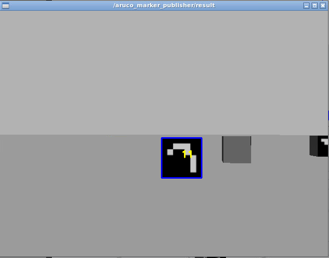

First assignment of Experimental robotics
================================
**Simone Borelli s4662264** <br>
**Veronica Gavagna s5487110** <br>
**Alessio Mura s4861320** <br>
**Massimo Carlini s4678445** <br>

The purpose of the first assignment of Experimental robotics is to implement the control of a robot in **ROS** or **ROS 2**, initially in the **Gazebo** environment and subsequently with a real Rosbot, to reach 4 markers with the following IDs: 11, 12, 13, and 15.
The IDs of the markers have specific meanings: 

* Marker 11 instructs the robot to rotate until it locates marker 12, then reaches it; 
* Marker 12 instructs the robot to rotate until it finds marker 13, then reaches it; 
* Marker 13 instructs the robot to rotate until it finds marker 15, then reaches it; 
* Once marker 15 is found, the robot stops as it has completed its tasks. 

In any case the marker detection can be considered complete when the center of the camera aligns with the center of the marker and, before moving on to the next search, the robot's camera must detect at least 170 pixels on one side of a marker. To achieve this, two ROS nodes have been developed: 

* The first is located within the **aruco_ros** package, named **marker_publisher**. This C++ node utilizes the [ArUco](http://wiki.ros.org/aruco) and [OpenCV](http://wiki.ros.org/opencv_apps) libraries to enable the camera for marker ID detection and publishes the first detected ID on the topic **/id_publisher**;
* The second node, written in Python, is part of the **rosbot_bringup** package and is named **realworld**. This node handles the control aspect of the robot to reach the predefined marker.

It is important to underline that, with the above-mentioned implementation, only the robot's control part is managed, not that of the camera. In other words, the camera, being fixed, rotates only when the robot rotates. To implement control of the camera as well, which is an optional task for the assignment, an additional node has been created: 

* The **simulation** python node, which is also part of the **rosbot_bringup** package. Additionally, it handles the rotation of the camera using a specific control topic, **/robot_exp/camera_velocity_controller/command**, and utilizes Euler angles control to align the camera with the robot when the marker is detected.

In addition to this, some modifications have been made to the **rosbot_gazebo.launch**, **rosbot_xacro**, and the addition of a **joint_state_controller** file to include, respectively, the plugins, hardware interface, and PID parameter values to enable camera control.

Installing and running
----------------------
For start the whole program, you have to do some several, but fundamental, step. First of all it is important to have **ROS noetic** version on your pc; the best simple suggestion is to have the [**Docker**](https://docs.docker.com/get-docker/) and then follow this [**ROS guide**](http://wiki.ros.org/ROS/Installation). In addition it is required to install **xterm** terminal; you can do that by using the command ```sudo apt-get install xterm``` on your docker terminal. 

You can clone our repository, by clicking on the terminal

```https://github.com/VeronicaG24/Assignment1_Exp```

Make sure to execute the above command within the **src** folder of your workspace. Then execute ```catkin_make``` inside the root of your workspace for building our package. <br>
Once you have done that, you must choose whether you want to launch the simulation with the robot having a fixed camera, meaning it only rotates in conjunction with the robot's movement, or if you want to launch the one with the camera that moves thanks to a continuous joint, i.e., a rotational joint without rotation limits. 
For the first case, launch the following command from the terminal:

```roslaunch rosbot_bringup camera_fixed.launch```

For the second one, use this other command:

```roslaunch rosbot_bringup exp1.launch```

In any case, if everything works properly, you should visualize the **Gazebo** environment with the Rosbot and the markers, 2 windows that prints if the marker is reached and the id number, and the **/aruco_marker_publisher_result** which simply shows what the camera detects. 


<table><tr>
  <td>  </td>
  <td>  </td>
</tr>
<tr>
   <td>Gazebo window</td>
   <td>/aruco_publisher_result window</td>
  </tr>
</table>

Flowchart 
----------------------

Simulation videos
----------------------
You can see the videos of both simulations: the first one is related to the fix camera.
<video width="320" height="240" controls>
  <source src="/video/Camera_fixed.mp4" type="video/mp4">
  Il tuo browser non supporta il tag video.
</video>


Real robot video
----------------------


Possible improvments
----------------------
