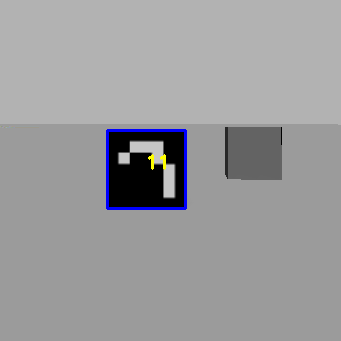

First assignment of Experimental robotics
================================
**Simone Borelli S4662264** <br>
**Veronica Gavagna S5487110** <br>
**Alessio Mura S4861320** <br>
**Massimo Carlini S4678445** <br>

Requirements
----------------------

The purpose of the first assignment of Experimental robotics is to implement the control of a robot in **ROS** or **ROS 2**, initially in the **Gazebo** environment and subsequently with a real Rosbot, to reach 4 markers with the following IDs: 11, 12, 13, and 15.

The IDs of the markers have specific meanings: 

* Marker 11 instructs the robot to rotate until it locates marker 12, then reaches it; 
* Marker 12 instructs the robot to rotate until it finds marker 13, then reaches it; 
* Marker 13 instructs the robot to rotate until it finds marker 15, then reaches it; 
* Once marker 15 is found, the robot stops as it has completed its tasks.

Notice that “reach marker xxx” means that one side of the xxx marker must be at least 170 pixels in the camera frame.

Implementation
----------------------

This is a possible implementation of the first assignment of Experimental for Robotics course.

The marker detection can be considered complete when the center of the camera aligns with the center of the marker and, before moving on to the next search, the robot's camera must detect at least 170 pixels on one side of a marker. To achieve this, two ROS nodes have been developed: 

* The first is located within the **aruco_ros** package, named **marker_publisher**. This C++ node utilizes the [ArUco](http://wiki.ros.org/aruco) and [OpenCV](http://wiki.ros.org/opencv_apps) libraries to enable the camera for marker ID detection and publishes the first detected ID on the topic **/id_publisher**;
* The second node, written in Python, is part of the **rosbot_bringup** package and is named **realworld**. This node handles the control aspect of the robot to reach the predefined marker.

It is important to underline that, with the above-mentioned implementation, only the robot's control part is managed, not that of the camera. In other words, the camera, being fixed, rotates only when the robot rotates. To implement control of the camera as well, which is an optional task for the assignment, an additional node has been created: 

* The **simulation** python node, which is also part of the **rosbot_bringup** package. Additionally, it handles the rotation of the camera using a specific control topic, **/robot_exp/camera_velocity_controller/command**, and utilizes Euler angles control to align the camera with the robot when the marker is detected.

In addition to this, some modifications have been made to the **rosbot_gazebo.launch**, **rosbot_xacro**, and the addition of a **joint_state_controller** file to include, respectively, the plugins, hardware interface, and PID parameter values to enable camera control.

Installing and running
----------------------
For start the whole program, you have to do some several, but fundamental, step. First of all it is important to have **ROS noetic** version on your pc; the best simple suggestion is to have the [**Docker**](https://docs.docker.com/get-docker/) and then follow this [**ROS guide**](http://wiki.ros.org/ROS/Installation). In addition it is required to install **xterm** terminal; you can do that by using the command on your terminal:

```python
sudo apt-get install xterm
``` 

You can clone our repository, by clicking on the terminal:

```python
https://github.com/VeronicaG24/Assignment1_Exp
```

Make sure to execute the above command within the **src** folder of your workspace. Then execute ```catkin_make``` inside the root of your workspace for building our package. <br>
Once you have done that, you must choose whether you want to launch the simulation with the robot having a fixed camera, meaning it only rotates in conjunction with the robot's movement, or if you want to launch the one with the camera that moves thanks to a continuous joint, i.e., a rotational joint without rotation limits. 

For the first case, launch the following command from the terminal:

```python
roslaunch rosbot_bringup camera_fixed.launch
```

For the second one, use this other command:

```python
roslaunch rosbot_bringup camera_moving.launch
```

In any case, if everything works properly, you should visualize the **Gazebo** environment with the Rosbot and the markers, 2 windows that prints if the marker is reached and the id number, and the **/aruco_marker_publisher_result** which simply shows what the camera detects. 


<table><tr>
  <td>  </td>
  <td>  </td>
</tr>
<tr>
   <td>Gazebo window</td>
   <td>/aruco_publisher_result window</td>
  </tr>
</table>

Pseudocode 
----------------------

The code for the first part where the camera is fixed is divided into separate functions as follow:

* `main()`: manages the robot so that it will reach the goal of having silver and golden boxes paired.
* `id_callback()`: callback function to get the ID of the marker detected by the camera.
* `marker_center_callback()`: callback function to get the center of the detected marker.
* `pixel_callback()`: callback function to get the number of the side of the target marker in pixel.
* `move_callback()`: callback function to manage the movement of the robot (described in the pseudocode below).

Then, the following global variables are used:
* `pixel_limit = 170`: limit for stopping the robot
* `width_camera = 320`: dimension of the camera
* `lin_vel_move = 0.2`: linear velocity
* `ang_vel_move = 0.5`: angular velocity
* `no_vel_move = 0.0`: stop velocity
* `pixel_thr = 18`: threshold in pixels for alignment
* `kp_d = 0.2`: control distance gain
* `kp_a = 3.0`: control angular gain
* `ub_d = 0.3`: upper bound distance


```python
Initialize and clean up ROS node
Create image_feature class
Compute the orientation data for camera and robot alignment
Loop until keyboard interrupt or until goal is completed
    Check if marker list is empty
    if empty, shutdown node
    else, continue
    Check if current marker is the first marker in the list
    if yes, then marker found
        Compute error between marker center and camera center
        Compute yaw error between robot and camera
        if yaw error is within threshold or robot is aligned with camera
            if robot aligned and pixel side is greater than limit, marker is reached
                Set linear velocity and angular velocity to zero
                Remove marker from list
            elif, pixel side is less than threshold, robot aligned with marker
                Set linear velocity to forward and angular velocity to zero
            else, robot needs to align with marker
                Set linear velocity to proportional to distance error
                Set angular velocity to proportional to yaw error
        else, robot needs to align with camera
            Set linear velocity to zero
            Set angular velocity to proportional to yaw error
    else, robot is looking for the target marker
        Set linear velocity to zero
        Set angular velocity to positive
Update marker and parameters
Destroy all windows
```

The code for the second part where the camera is moving is divided into separate functions as follow:

* `main()`: manages the robot so that it will reach the goal of having silver and golden boxes paired.
* `id_callback()`: callback function to get the ID of the marker detected by the camera.
* `marker_center_callback()`: callback function to get the center of the detected marker.
* `pixel_callback()`: callback function to get the number of the side of the target marker in pixel.
* `pose_callback()`: callback function to get the orientation of the robot and the orientation of the camera to compute the euler transformation and get the yaw.
* `normalize_callback()`: function for normalizing angles.
* `move_callback()`: callback function to manage the movement of the robot and the camera (described in the pseudocode below).

Then, the following global variables are used:
* `pixel_limit = 165`: limit for stopping the robot
* `width_camera = 320`: dimension of the camera
* `lin_vel_move = 0.2`: linear velocity
* `ang_vel_move = 0.5`: angular velocity
* `no_vel_move = 0.0`: stop velocity
* `pixel_thr = 18`: threshold in pixels for alignment
* `kp_d = 0.2`: control distance gain
* `kp_a = 3.0`: control angular gain
* `ub_d = 0.3`: upper bound distance
* `ub_cr = 0.4`: upper bound camera rotation
* `ub_br = 0.5`: upper bound base rotation
* `yaw_thr = math.pi / 90`: +/- 2 degree allowed for yaw


```python
Initialize and clean up ROS node
Create image_feature class
Loop until keyboard interrupt or until goal is completed
    Check if marker list is empty
    if empty, shutdown node
    else, continue
    Check if current marker is the first marker in the list
    if yes, then marker found
        Compute error between marker center and camera center
        if error is less than pixel threshold, robot is aligned
            Check if robot yaw is within threshold
            if yes, set linear velocity to forward and angular velocity to zero
            else, rotate robot until yaw is within threshold
        else, if current pixel side is greater than pixel limit, marker is reached
            Set linear velocity and angular velocity to zero
            Remove marker from list
        else, robot needs to align with marker
            Set linear velocity to proportional to error
            Set angular velocity to proportional to error
    else, robot is looking for the target marker
        Set linear velocity to zero
        Set angular velocity to positive
Update marker and parameters
Destroy all windows
```


Simulation videos
----------------------
You can see the videos of both simulations: the first one is related to the fix camera.

 

 
 
 The second one shows the rotation of the camera.

 
 

Real robot video
----------------------


Possible improvements
----------------------
Here are some possible improvements:

* A more efficient solution would be not to have a numerical list of marker IDs but to implement functions that read actions related to specific marker IDs from a text file. Creating a mapping between text lines and actions at the code level that the robot needs to execute would overcome the limitation of the predetermined sorting required by the list to function correctly with our code structure;
* To manage the shutdown of the two ROS nodes, a more elegant solution would be to create a custom service with a boolean as part of the response. This service can be called by the **marker_publisher** node, and when it receives, for example, a true value, it initiates the shutdown. This, rather than just an improvement, can be seen as a proper utilization of both ROS parameters and the client services structure.
